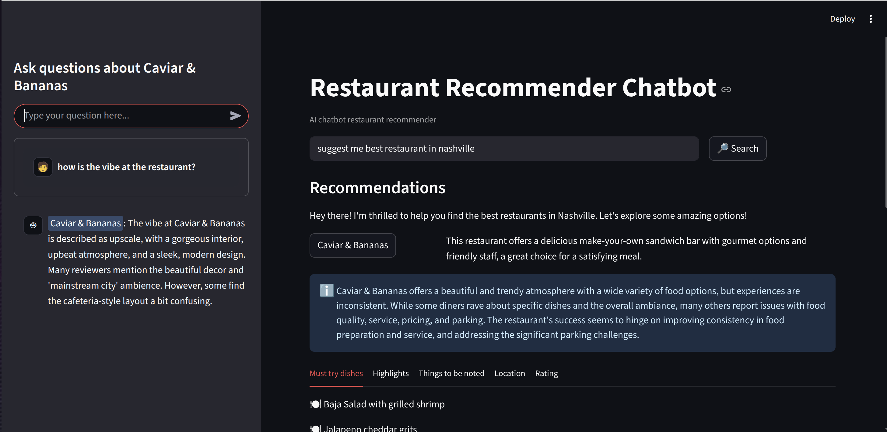

# llm-restaurant-recommender
Restaurant recommender chatbot using Retrieval-Augmented Generation (RAG) with LlamaIndex, Elasticsearch, Ollama, and Gemini. Interactive UI via Streamlit and FastAPI.

---
## Overview
Reading restaurant reviews can be overwhelming.They are often long, detailed, and time-consuming to go through. This chatbot, built on the **Yelp Open Dataset**, acts as a user’s assistant by analyzing reviews and providing clear, concise insights. It can recommend restaurants, answer specific questions, and highlight both positive and negative aspects of a restaurant to simplify the restaurant selection process.
It leverages **Elasticsearch** for semantic search, **Gemini LLM** for natural language generation, and **LlamaIndex** for RAG orchestration. The system is built with **FastAPI** for backend services and **Streamlit** for an interactive user interface.
The project is fully **containerized** with **Docker**, with automated deployment pipelines via **GitHub Actions**.

---

---
##  Features
The system helps users by:

- Recommending restaurants based on their preferences.

- Context-aware responses powered by RAG.

- Answering specific questions about restaurants.

- Summarizing reviews to highlight both strengths and weaknesses.
 
---
## Tech Stack

- RAG Framework: LlamaIndex

- Retriever / DB: Elasticsearch (Docker)

- Embeddings: Ollama (all-minilm)

- Generative Model: Gemini

- Backend: FastAPI

- UI: Streamlit

---
## CI/CD & Deployment

- GitHub Actions automate builds and testing on every push.

- A Docker image is built and published as part of the workflow, ensuring consistency across environments.

- The project currently runs locally for development and demo purposes, but the workflow is ready to be extended for deployment to platforms like Render, Railway, or HuggingFace Spaces.